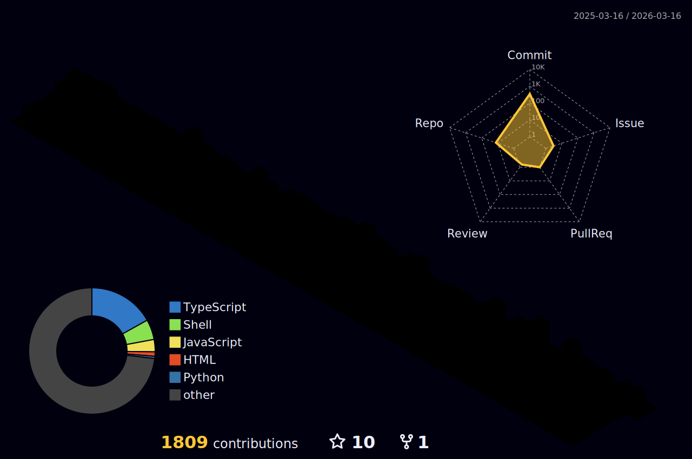

<h1 align="center">Hi 👋, I'm sunday</h1>
<h3 align="center">A passionate frontend developer from China</h3>

<h3 align="left">Connect with me:</h3>
<p align="left">
</p>

### Languaues and Tools

<span >  
  <a href="https://nextjs.org/" target="_blank" rel="noreferrer">  </a>
  <a href="https://reactjs.org/" target="_blank" rel="noreferrer">  </a>
  <a href="https://vuejs.org/" target="_blank" rel="noreferrer">  </a>
  <a href="https://www.w3.org/html/" target="_blank" rel="noreferrer">  </a>
  <a href="https://www.w3schools.com/css/" target="_blank" rel="noreferrer">  </a>
  <a href="https://tailwindcss.com/" target="_blank" rel="noreferrer">  </a>
  <a href="https://www.typescriptlang.org/" target="_blank" rel="noreferrer">  </a>
  <a href="https://developer.mozilla.org/en-US/docs/Web/JavaScript" target="_blank" rel="noreferrer">  </a>
  <a href="https://nodejs.org" target="_blank" rel="noreferrer">  </a>
  <a href="https://www.python.org" target="_blank" rel="noreferrer">  </a>
  <a href="https://expressjs.com" target="_blank" rel="noreferrer">  </a> 
  <a href="https://www.docker.com/" target="_blank" rel="noreferrer">  </a>
  <a href="https://www.figma.com/" target="_blank" rel="noreferrer">  </a> 
  <a href="https://git-scm.com/" target="_blank" rel="noreferrer">  </a>
  <a href="https://www.linux.org/" target="_blank" rel="noreferrer">  </a> <a href="https://www.mongodb.com/" target="_blank" rel="noreferrer">  </a> <a href="https://www.mysql.com/" target="_blank" rel="noreferrer">  </a>  <a href="https://www.nginx.com" target="_blank" rel="noreferrer">  </a>
  <a href="https://www.postgresql.org" target="_blank" rel="noreferrer">  </a> <a href="https://postman.com" target="_blank" rel="noreferrer">  </a> <a href="https://github.com/puppeteer/puppeteer" target="_blank" rel="noreferrer">  </a>
  <a href="https://reactnative.dev/" target="_blank" rel="noreferrer">  </a> <a href="https://redis.io" target="_blank" rel="noreferrer">  </a> <a href="https://www.selenium.dev" target="_blank" rel="noreferrer">  </a> <a href="https://www.sketch.com/" target="_blank" rel="noreferrer">  </a>
    <a href="https://zapier.com" target="_blank" rel="noreferrer">  </a>
  <a href="https://www.chartjs.org" target="_blank" rel="noreferrer">  </a>
  <a href="https://aws.amazon.com" target="_blank" rel="noreferrer">  </a>
  <a href="https://cloud.google.com" target="_blank" rel="noreferrer">  </a> 
</span>

### My GitHub Stats

<div align="left">
   
  
</div>

### My Activities

<!--START_SECTION:waka-->


**🐱 My GitHub Data** 

> 📦 ? Used in GitHub's Storage 
 > 
> 🏆 560 Contributions in the Year 2025
 > 
> 🚫 Not Opted to Hire
 > 
> 📜 31 Public Repositories 
 > 
> 🔑 0 Private Repositories 
 > 
**I'm a Night 🦉** 

```text
🌞 Morning                358 commits         ███░░░░░░░░░░░░░░░░░░░░░░   11.47 % 
🌆 Daytime                1080 commits        █████████░░░░░░░░░░░░░░░░   34.59 % 
🌃 Evening                1055 commits        ████████░░░░░░░░░░░░░░░░░   33.79 % 
🌙 Night                  629 commits         █████░░░░░░░░░░░░░░░░░░░░   20.15 % 
```
📅 **I'm Most Productive on Friday** 

```text
Monday                   411 commits         ███░░░░░░░░░░░░░░░░░░░░░░   13.16 % 
Tuesday                  516 commits         ████░░░░░░░░░░░░░░░░░░░░░   16.53 % 
Wednesday                495 commits         ████░░░░░░░░░░░░░░░░░░░░░   15.86 % 
Thursday                 501 commits         ████░░░░░░░░░░░░░░░░░░░░░   16.05 % 
Friday                   603 commits         █████░░░░░░░░░░░░░░░░░░░░   19.31 % 
Saturday                 333 commits         ███░░░░░░░░░░░░░░░░░░░░░░   10.67 % 
Sunday                   263 commits         ██░░░░░░░░░░░░░░░░░░░░░░░   08.42 % 
```


📊 **This Week I Spent My Time On** 

```text
🕑︎ Time Zone: Asia/Shanghai

💬 Programming Languages: 
TypeScript               12 hrs 30 mins      ███████████░░░░░░░░░░░░░░   43.11 % 
JavaScript               5 hrs 39 mins       █████░░░░░░░░░░░░░░░░░░░░   19.51 % 
JSON                     3 hrs 55 mins       ███░░░░░░░░░░░░░░░░░░░░░░   13.52 % 
Other                    3 hrs 51 mins       ███░░░░░░░░░░░░░░░░░░░░░░   13.33 % 
Bash                     1 hr 25 mins        █░░░░░░░░░░░░░░░░░░░░░░░░   04.90 % 

🔥 Editors: 
Cursor                   29 hrs              █████████████████████████   100.00 % 

🐱‍💻 Projects: 
onetool-mini             8 hrs 41 mins       ███████░░░░░░░░░░░░░░░░░░   29.99 % 
itab                     6 hrs 56 mins       ██████░░░░░░░░░░░░░░░░░░░   23.93 % 
onetool                  5 hrs 56 mins       █████░░░░░░░░░░░░░░░░░░░░   20.49 % 
bing-wallpaper           4 hrs 6 mins        ████░░░░░░░░░░░░░░░░░░░░░   14.15 % 
onetool-mini-admin       1 hr 37 mins        █░░░░░░░░░░░░░░░░░░░░░░░░   05.59 % 

💻 Operating System: 
Mac                      29 hrs              █████████████████████████   100.00 % 
```

**I Mostly Code in TypeScript** 

```text
TypeScript               26 repos            █████████░░░░░░░░░░░░░░░░   34.67 % 
JavaScript               25 repos            ████████░░░░░░░░░░░░░░░░░   33.33 % 
Python                   5 repos             ██░░░░░░░░░░░░░░░░░░░░░░░   06.67 % 
HTML                     3 repos             █░░░░░░░░░░░░░░░░░░░░░░░░   04.00 % 
Shell                    3 repos             █░░░░░░░░░░░░░░░░░░░░░░░░   04.00 % 
```


**Timeline**


 Last Updated on 27/08/2025 18:18:38 UTC
<!--END_SECTION:waka-->

### My GitHub Contributions


