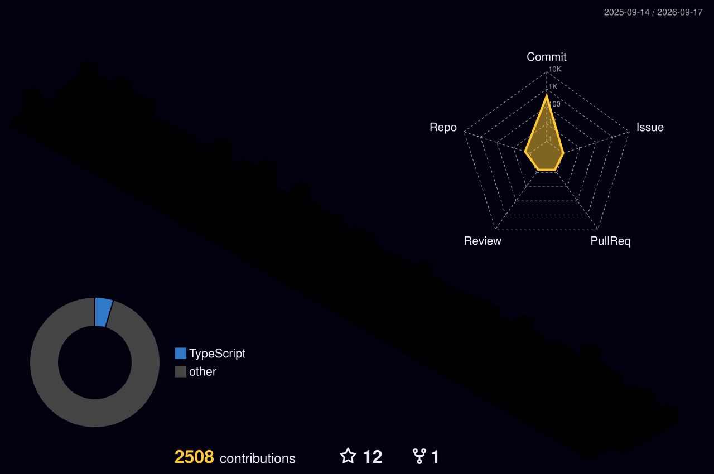

<h1 align="center">Hi 👋, I'm sunday</h1>
<h3 align="center">A passionate frontend developer from China</h3>

<h3 align="left">Connect with me:</h3>
<p align="left">
</p>

### Languaues and Tools

<span >  
  <a href="https://nextjs.org/" target="_blank" rel="noreferrer">  </a>
  <a href="https://reactjs.org/" target="_blank" rel="noreferrer">  </a>
  <a href="https://vuejs.org/" target="_blank" rel="noreferrer">  </a>
  <a href="https://www.w3.org/html/" target="_blank" rel="noreferrer">  </a>
  <a href="https://www.w3schools.com/css/" target="_blank" rel="noreferrer">  </a>
  <a href="https://tailwindcss.com/" target="_blank" rel="noreferrer">  </a>
  <a href="https://www.typescriptlang.org/" target="_blank" rel="noreferrer">  </a>
  <a href="https://developer.mozilla.org/en-US/docs/Web/JavaScript" target="_blank" rel="noreferrer">  </a>
  <a href="https://nodejs.org" target="_blank" rel="noreferrer">  </a>
  <a href="https://www.python.org" target="_blank" rel="noreferrer">  </a>
  <a href="https://expressjs.com" target="_blank" rel="noreferrer">  </a> 
  <a href="https://www.docker.com/" target="_blank" rel="noreferrer">  </a>
  <a href="https://www.figma.com/" target="_blank" rel="noreferrer">  </a> 
  <a href="https://git-scm.com/" target="_blank" rel="noreferrer">  </a>
  <a href="https://www.linux.org/" target="_blank" rel="noreferrer">  </a> <a href="https://www.mongodb.com/" target="_blank" rel="noreferrer">  </a> <a href="https://www.mysql.com/" target="_blank" rel="noreferrer">  </a>  <a href="https://www.nginx.com" target="_blank" rel="noreferrer">  </a>
  <a href="https://www.postgresql.org" target="_blank" rel="noreferrer">  </a> <a href="https://postman.com" target="_blank" rel="noreferrer">  </a> <a href="https://github.com/puppeteer/puppeteer" target="_blank" rel="noreferrer">  </a>
  <a href="https://reactnative.dev/" target="_blank" rel="noreferrer">  </a> <a href="https://redis.io" target="_blank" rel="noreferrer">  </a> <a href="https://www.selenium.dev" target="_blank" rel="noreferrer">  </a> <a href="https://www.sketch.com/" target="_blank" rel="noreferrer">  </a>
    <a href="https://zapier.com" target="_blank" rel="noreferrer">  </a>
  <a href="https://www.chartjs.org" target="_blank" rel="noreferrer">  </a>
  <a href="https://aws.amazon.com" target="_blank" rel="noreferrer">  </a>
  <a href="https://cloud.google.com" target="_blank" rel="noreferrer">  </a> 
</span>

### My GitHub Stats

<div align="left">
   
  
</div>

### My Activities

<!--START_SECTION:waka-->


**🐱 My GitHub Data** 

> 📦 ? Used in GitHub's Storage 
 > 
> 🏆 1,186 Contributions in the Year 2026
 > 
> 🚫 Not Opted to Hire
 > 
> 📜 33 Public Repositories 
 > 
> 🔑 0 Private Repositories 
 > 
**I'm a Night 🦉** 

```text
🌞 Morning                818 commits         ████░░░░░░░░░░░░░░░░░░░░░   14.48 % 
🌆 Daytime                1483 commits        ███████░░░░░░░░░░░░░░░░░░   26.25 % 
🌃 Evening                1589 commits        ███████░░░░░░░░░░░░░░░░░░   28.13 % 
🌙 Night                  1759 commits        ████████░░░░░░░░░░░░░░░░░   31.14 % 
```
📅 **I'm Most Productive on Friday** 

```text
Monday                   762 commits         ███░░░░░░░░░░░░░░░░░░░░░░   13.49 % 
Tuesday                  845 commits         ████░░░░░░░░░░░░░░░░░░░░░   14.96 % 
Wednesday                828 commits         ████░░░░░░░░░░░░░░░░░░░░░   14.66 % 
Thursday                 856 commits         ████░░░░░░░░░░░░░░░░░░░░░   15.15 % 
Friday                   1003 commits        ████░░░░░░░░░░░░░░░░░░░░░   17.76 % 
Saturday                 760 commits         ███░░░░░░░░░░░░░░░░░░░░░░   13.45 % 
Sunday                   595 commits         ███░░░░░░░░░░░░░░░░░░░░░░   10.53 % 
```


📊 **This Week I Spent My Time On** 

```text
🕑︎ Time Zone: Asia/Shanghai

💬 Programming Languages: 
Swift                    25 hrs 22 mins      █████████████░░░░░░░░░░░░   51.87 % 
TypeScript               9 hrs 14 mins       █████░░░░░░░░░░░░░░░░░░░░   18.87 % 
Markdown                 4 hrs 52 mins       ██░░░░░░░░░░░░░░░░░░░░░░░   09.95 % 
Other                    4 hrs 28 mins       ██░░░░░░░░░░░░░░░░░░░░░░░   09.13 % 
Python                   2 hrs 49 mins       █░░░░░░░░░░░░░░░░░░░░░░░░   05.78 % 

🔥 Editors: 
Codex Vscode             28 hrs 48 mins      ███████████████░░░░░░░░░░   58.86 % 
Claude Code              12 hrs 23 mins      ██████░░░░░░░░░░░░░░░░░░░   25.32 % 
Cursor                   6 hrs 16 mins       ███░░░░░░░░░░░░░░░░░░░░░░   12.83 % 
Agent                    1 hr 28 mins        █░░░░░░░░░░░░░░░░░░░░░░░░   03.00 % 

🐱‍💻 Projects: 
Real Todo                15 hrs 47 mins      ████████░░░░░░░░░░░░░░░░░   32.26 % 
RunO                     7 hrs 42 mins       ████░░░░░░░░░░░░░░░░░░░░░   15.76 % 
Weather Island           5 hrs 56 mins       ███░░░░░░░░░░░░░░░░░░░░░░   12.13 % 
notonyet                 5 hrs 37 mins       ███░░░░░░░░░░░░░░░░░░░░░░   11.48 % 
ipocket-tools            5 hrs 28 mins       ███░░░░░░░░░░░░░░░░░░░░░░   11.20 % 

💻 Operating System: 
Mac                      48 hrs 56 mins      █████████████████████████   100.00 % 
```

🤖 **AI Coding This Week** 

```text
⏱ AI Coding Time: 48 hrs 36 mins (99.34%)

✍️ 31,978 lines written by AI, 81 lines written by hand (99.75% AI-written)

🔤 47,949,716 Input Tokens, 3,934,895 Output Tokens

💵 $1183.80 Estimated AI Cost This Week

🧠 91 AI Sessions, 395 AI Prompts

GPT                      24,311 lines        ██████████████████░░░░░░░   72.84 % 
Opus                     4,686 lines         ████░░░░░░░░░░░░░░░░░░░░░   14.04 % 
Fable                    3,002 lines         ██░░░░░░░░░░░░░░░░░░░░░░░   08.99 % 
Composer                 1,376 lines         █░░░░░░░░░░░░░░░░░░░░░░░░   04.12 % 

🔎 AI Coding Insights:
🤖 AI-Driven — 99.75% of written lines came from AI
📄 Detailed Prompter — average 1,206 characters per prompt
🔁 Iterative Prompter — average 4 prompts per session
🚀 High AI Trust — 0.27% of changed lines were hand-edited
```

**I Mostly Code in TypeScript** 

```text
TypeScript               34 repos            █████████░░░░░░░░░░░░░░░░   36.17 % 
JavaScript               24 repos            ██████░░░░░░░░░░░░░░░░░░░   25.53 % 
Swift                    9 repos             ██░░░░░░░░░░░░░░░░░░░░░░░   09.57 % 
Python                   7 repos             ██░░░░░░░░░░░░░░░░░░░░░░░   07.45 % 
Astro                    1 repo              ░░░░░░░░░░░░░░░░░░░░░░░░░   01.06 % 
```


**Timeline**


 Last Updated on 01/09/2026 20:20:48 UTC
<!--END_SECTION:waka-->

### My GitHub Contributions


